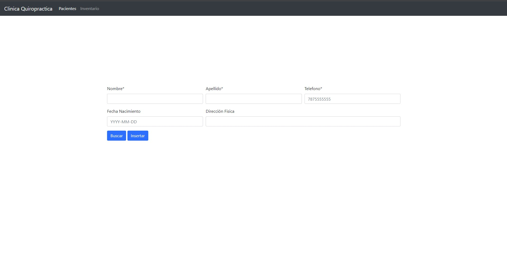
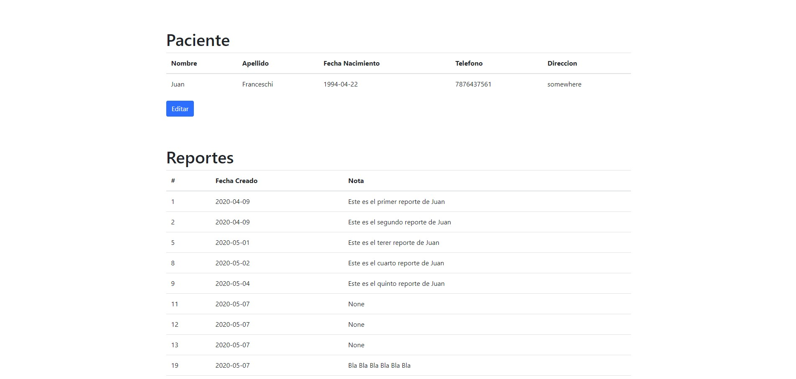
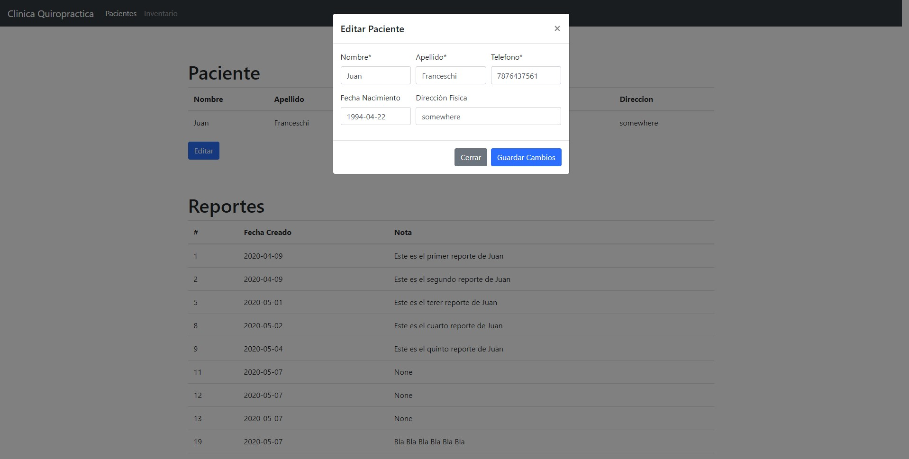
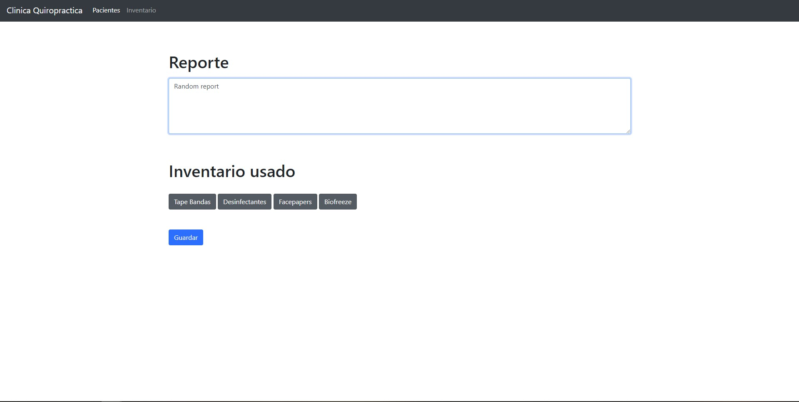
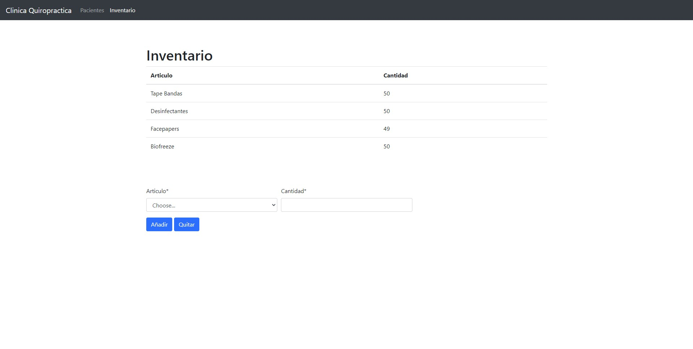

# Database Proyect - Quiropractic Clinic
This is a proyect for the undergraduate class of Databases

Warning:

Server must be running beforehand

To run: 

```set FLASK_APP=gui.py```

```-m flask run```


*Homescreen*


*Patient Form*


*Patient Information*



*Edit Patient Information*



*Create Report*



*Inventory Management*

